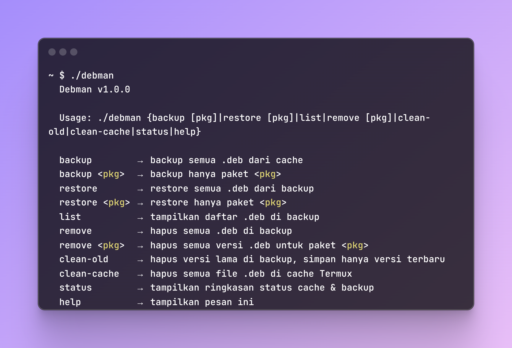

# TERMUX DEB MANAGER
Backup dan restore file .deb di termux

Installation
```bash
curl -L https://raw.githubusercontent.com/curink/termux_deb_manager/refs/heads/main/install.sh | bash
```

Screenshot
